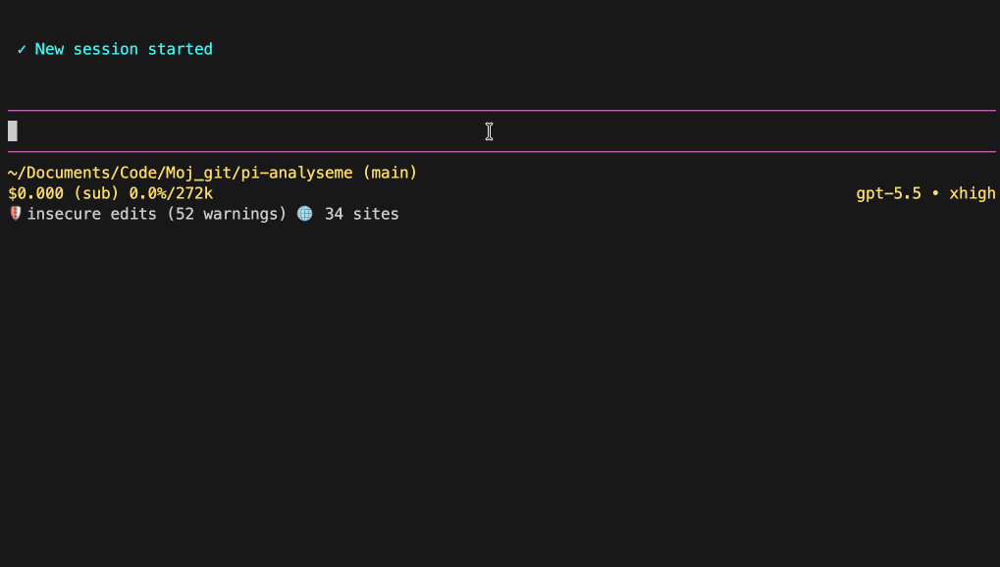

<p align="center">
  
</p>

<p align="center">
  <a href="https://pi.dev"></a>
  <a href="https://www.npmjs.com/package/@senad-d/analyseme"></a>
  <a href="LICENSE"></a>
  <a href="https://sonarcloud.io/summary/new_code?id=senad-d_AnalyseMe"></a>
</p>

<p align="center">
  SonarQube and SonarCloud analysis for <a href="https://pi.dev">pi</a>.
  <br />Let agents inspect quality gates, active issues, source context, and security hotspots from the terminal.
</p>

---

AnalyseMe is a Pi extension for coding agents. It reads existing SonarQube/SonarCloud analysis data, summarizes project health, lists actionable findings, and fetches issue or hotspot details with Sonar-provided guidance.

<table align="center">
  <tr>
    <th>AnalyseMe demo</th>
  </tr>
  <tr>
    <td align="center">
      
    </td>
  </tr>
</table>

- **Read-only boundary:** no Sonar mutations, repository writes, comments, assignments, or configuration changes.
- **Agent-ready context:** quality gates, metrics, locations, snippets, rule guidance, and hotspot guidance are returned in pi tool output.
- **Project-aware:** resolves project keys from tool input, environment, or `sonar-project.properties`.
- **Scope-aware:** supports branch and pull request analysis contexts.
- **Secret-safe:** Sonar tokens are masked in command output, tool output, details, errors, and tests.

> **Security:** pi packages run with your full system permissions. AnalyseMe reads local configuration and sends read-only requests to your configured Sonar URL. Read [`SECURITY.md`](SECURITY.md).

## Table of Contents

- [Quick Start](#quick-start)
- [Installation](#installation)
- [Configuration](#configuration)
- [Commands and Tools](#commands-and-tools)
- [Troubleshooting](#troubleshooting)
- [Development and Validation](#development-and-validation)
- [Update and Uninstall](#update-and-uninstall)
- [Publishing](#publishing)
- [License](#license)

---

## Quick Start

```bash
pi install npm:@senad-d/analyseme
```

Set the Sonar variables shown in [Configuration](#configuration), then start pi:

```bash
pi
```

Check status and help:

```text
/analyseme
/analyseme help
```

Ask the agent to use AnalyseMe:

```text
Use AnalyseMe to inspect the project summary and list the top 10 active Sonar issues.
```

AnalyseMe reads existing Sonar analysis data; it does not run a scanner.

---

## Installation

| Scope | Command | Notes |
| --- | --- | --- |
| Global | `pi install npm:@senad-d/analyseme` | Loads in every trusted pi project. |
| Project-local | `pi install npm:@senad-d/analyseme -l` | Writes to `.pi/settings.json` in the current project. |
| One run | `pi -e npm:@senad-d/analyseme` | Try without changing settings. |
| Git | `pi install git:github.com/senad-d/analyseme@<tag>` | Pin a tag or commit. |
| Local checkout | `pi --no-extensions -e .` | Develop or smoke-test this repository in isolation. |

Source checkout:

```bash
git clone https://github.com/senad-d/analyseme.git
cd analyseme
npm ci
npm run validate
pi --no-extensions -e .
```

---

## Configuration

AnalyseMe reads shell environment variables first, then a local project `.env` file. Shell variables win, and AnalyseMe never writes configuration files.

| Variable | Required | Meaning |
| --- | --- | --- |
| `SONARQUBE_URL` | Yes | SonarQube/SonarCloud base URL. Use HTTPS unless explicitly testing a trusted local HTTP server. |
| `SONARQUBE_TOKEN` | Yes | Sonar API token with read access to the target project. |
| `SONARQUBE_ORGANIZATION` | SonarCloud usually | SonarCloud organization. |
| `SONARQUBE_PROJECT_KEY` | Usually | Default project key when no tool `projectKey` is passed. |
| `SONARQUBE_BRANCH` | No | Branch analysis scope. Do not set with `SONARQUBE_PULL_REQUEST`. |
| `SONARQUBE_PULL_REQUEST` | No | Pull request analysis scope. Do not set with `SONARQUBE_BRANCH`. |
| `SONARQUBE_ALLOW_INSECURE_HTTP=true` | No | Development-only opt-in for trusted non-TLS Sonar URLs. |

Minimal local setup:

```bash
SONARQUBE_URL="https://sonarcloud.io"
SONARQUBE_TOKEN="replace-with-local-token"
SONARQUBE_ORGANIZATION="your-organization"
SONARQUBE_PROJECT_KEY="your-project-key"
```

Resolution order:

- Project key: explicit tool input → `SONARQUBE_PROJECT_KEY` → `sonar-project.properties` `sonar.projectKey`.
- Analysis scope: explicit tool input → configured branch/PR variable → GitHub Actions context.

GitHub Actions example:

```yaml
jobs:
  analyseme:
    runs-on: ubuntu-latest
    steps:
      - uses: actions/checkout@v4
      - name: Run Pi with AnalyseMe
        env:
          SONARQUBE_URL: ${{ secrets.SONARQUBE_URL }}
          SONARQUBE_TOKEN: ${{ secrets.SONARQUBE_TOKEN }}
          SONARQUBE_ORGANIZATION: ${{ secrets.SONARQUBE_ORGANIZATION }}
          SONARQUBE_PROJECT_KEY: ${{ vars.SONARQUBE_PROJECT_KEY }}
          SONARQUBE_BRANCH: ${{ github.ref_name }}
        run: |
          pi --no-session -e npm:@senad-d/analyseme \
            -p "Use AnalyseMe to inspect the project summary and active issues."
```

---

## Commands and Tools

| Surface | Name | Use it for |
| --- | --- | --- |
| Command | `/analyseme` | Show masked configuration/status output. |
| Command | `/analyseme help` | Show setup, CI, and usage guidance. |
| Tool | `analyseme_get_project_summary` | Quality gate and summary metrics. |
| Tool | `analyseme_list_issues` | Active actionable issues with pagination. |
| Tool | `analyseme_get_issue` | One issue's location, flows, source snippets, links, and Sonar rule guidance. |
| Tool | `analyseme_list_security_hotspots` | Security hotspots requiring review. |
| Tool | `analyseme_get_security_hotspot` | One hotspot's location, source context, links, and Sonar security guidance. |

Suggested workflow:

1. Start with `analyseme_get_project_summary`.
2. Page through `analyseme_list_issues` or `analyseme_list_security_hotspots` with a bounded `limit`.
3. Fetch a specific issue or hotspot before changing code.

Large results include visible truncation notices and structured metadata in `details`.

---

## Troubleshooting

| Problem | Try |
| --- | --- |
| Missing URL or token | Set `SONARQUBE_URL` and `SONARQUBE_TOKEN`. |
| SonarCloud cannot find the project | Set `SONARQUBE_ORGANIZATION` and `SONARQUBE_PROJECT_KEY`, or pass them as tool inputs. |
| Wrong project is queried | Pass `projectKey` explicitly or fix `SONARQUBE_PROJECT_KEY`. |
| Branch/PR conflict | Set only one of `SONARQUBE_BRANCH` or `SONARQUBE_PULL_REQUEST`. |
| HTTP URL is rejected | Prefer HTTPS, or set `SONARQUBE_ALLOW_INSECURE_HTTP=true` only for trusted local development. |
| 401/403 response | Verify the token can read the target project and analysis scope. |
| Too much output | Use `limit`, `page`, or fetch a single issue/hotspot. |

---

## Development and Validation

```bash
npm ci
npm run typecheck
npm run lint
npm run format:check
npm run test
npm run check:pack
npm run validate
npm run smoke:pi
```

Isolated interactive smoke test:

```bash
PI_SKIP_VERSION_CHECK=1 PI_TELEMETRY=0 pi --no-extensions -e .
```

`npm run validate` includes type checking, linting, formatting checks, tests, package script checks, and package dry-run validation. CI runs the same validation chain.

Project docs:

- [`docs/STRUCTURE.md`](docs/STRUCTURE.md) — repository layout and boundaries.
- [`docs/VALIDATION.md`](docs/VALIDATION.md) — validation and smoke-test details.
- [`specs/spec-architecture.md`](specs/spec-architecture.md) — architecture plan.
- [`specs/spec-guidelines.md`](specs/spec-guidelines.md) — implementation guidelines.
- [`specs/spec-tasks.md`](specs/spec-tasks.md) — implementation task list.

---

## Update and Uninstall

```bash
pi update --extensions                       # update installed pi packages
pi update npm:@senad-d/analyseme          # update AnalyseMe only
pi remove npm:@senad-d/analyseme          # remove global install
pi remove npm:@senad-d/analyseme -l       # remove project-local install
```

---

## Publishing

AnalyseMe publishes to npm as `@senad-d/analyseme`.

```bash
npm login
npm whoami
node scripts/publish-npm.mjs
```

Run the publish script only from a clean working tree after updating `CHANGELOG.md`.

---

## License

MIT
